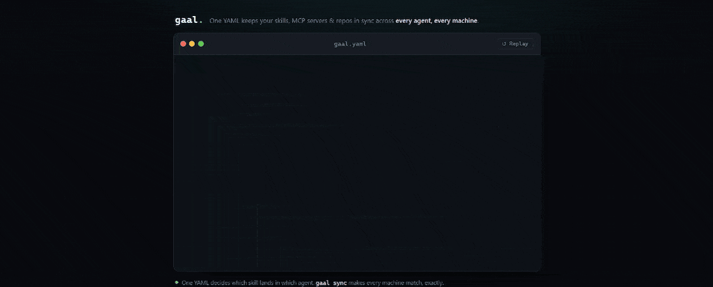

<h1 align="center">
  <a href="https://getgaal.com" target="_blank">
    
  </a>
</h1>

<p align="center">
  <b>One YAML to keep your AI coding agents in sync.</b><br/>
  Skills, MCP servers, and repositories, reconciled across every agent on every machine.
</p>

<div align="center">
  
</div>

<p align="center">
  <a href="https://getgaal.com"><b>Website</b></a> &nbsp;•&nbsp;
  <a href="https://docs.getgaal.com"><b>Docs</b></a> &nbsp;•&nbsp;
  <a href="docs/quick_start.md"><b>Quick start</b></a> &nbsp;•&nbsp;
  <a href="https://github.com/getgaal/gaal/issues/new/choose"><b>Report a bug</b></a>
</p>

<div align="center">

[](https://github.com/getgaal/gaal/releases)
[](https://github.com/getgaal/gaal/actions/workflows/ci.yml)
[](LICENSE)
[](go.mod)
[](https://github.com/getgaal/gaal/stargazers)

</div>

---

If you use more than one AI coding agent (Claude Code, Cursor, Codex, GitHub Copilot, …) across more than one machine, gaal keeps your skills, MCP servers, and repositories in one YAML and reconciles every agent on every machine to match.

## Features

gaal manages five things from a single `gaal.yaml`:

1. **Repositories**: code repos cloned and pinned to a version (git, hg, svn, bzr, tar, zip)
2. **Skills**: AI agent skills (`SKILL.md` collections) installed into each agent's directory
3. **Content**: files your agents read directly (`AGENTS.md`, `CLAUDE.md`, rule files) copied into place
4. **MCP servers**: server entries upserted into each agent's config, leaving the rest of the file untouched
5. **Sync commands**: `sync`, `status`, `doctor`, and `--dry-run` to reconcile and inspect everything above

And it does that with:

- [x] **Per-agent targeting**: send any of the above to one agent, a chosen few, or `["*"]` for all
- [x] **17 agents auto-detected**: Claude Code, Cursor, Codex, Copilot, Gemini CLI, Windsurf, and more
- [x] **Every machine identical**: run it once, or as a background service that keeps things in sync
- [x] **Drift and health checks**: `gaal status` and `gaal doctor` show what is out of sync or broken
- [x] **Safe by default**: `gaal sync --dry-run` previews every change before a single file is written
- [x] **Yours alone**: no telemetry by default; secrets stay as env references, never written to disk

Plus a lightweight **tools** check: `gaal doctor` and `gaal sync` verify that required CLI binaries (e.g. `gh`, `fnm`) are on PATH and surface install hints when they are missing.

---

## The YAML

One file. Every agent.

```yaml
schema: 1

# 1. code repos to keep cloned
repositories:
  src/gaal:
    type: git
    url: https://github.com/getgaal/gaal.git
    version: v0.3.0

# 2. AI agent skills
skills:
  - source: obra/superpowers
    # auto-detect every installed agent
    agents: ["*"]
    # shared across projects
    global: true

# 3. files agents read directly
content:
  - source: ./agent-files
    agents: ["claude-code"]
    paths:
      AGENTS.md: CLAUDE.md

# 4. MCP servers
mcps:
  - name: context7
    agents: ["claude-code", "cursor", "codex"]
    global: true
    inline:
      command: npx
      args: ["-y", "@upstash/context7-mcp"]

# 5. commands around sync
hooks:
  post-sync:
    - command: git
      args: ["-C", "~/docs", "pull"]
```

Run `gaal sync`. gaal figures out which agents are installed and writes to the right place for each.

---

## Install

### Quick install (macOS / Linux)

```bash
curl -fsSL https://raw.githubusercontent.com/getgaal/gaal/main/scripts/install.sh | sh
```

Installs the latest release binary to `~/.local/bin/gaal`. Pin a specific
version with `VERSION=v0.1.2`, or pick a different directory with
`INSTALL_DIR=/usr/local/bin`.

Pass `GAAL_INSTALL_DEBUG=1` for verbose output, or run
`curl -fsSL https://raw.githubusercontent.com/getgaal/gaal/main/scripts/install.sh | sh -s -- --help`
to see all options.

### With Go

```bash
go install github.com/getgaal/gaal@latest
```

### From source

**Prerequisites:** Go 1.26+

```bash
git clone https://github.com/getgaal/gaal.git
cd gaal
make build
```

The binary is written to `dist/gaal`. Copy it to your `$PATH`:

```bash
sudo cp dist/gaal /usr/local/bin/gaal
# or, user-local:
cp dist/gaal ~/.local/bin/gaal
```

---

## Quick start

The fastest way to get a working `gaal.yaml` is to run the interactive init
wizard. It scans your machine for installed skills and MCP servers, asks you
a few questions, and writes a configuration you can sync right away.

```bash
gaal init
```

The wizard asks two questions before doing anything:

1. **How** to create the file — start from an empty documented skeleton, or
   import the skills and MCP servers detected on this machine.
2. **Where** the configuration applies — project-scoped (`./gaal.yaml`) or
   global-scoped (`~/.config/gaal/config.yaml`).

When you pick the import mode, gaal runs an audit under the selected scope
and presents a multi-select list grouped by agent. Everything is preselected
by default; press Enter to confirm, or Space to toggle individual entries.

### Non-interactive (CI / scripts)

The wizard prompts are bypassable via flags:

```bash
# Empty skeleton, project-scoped
gaal init --empty --scope project

# Import everything detected, global-scoped, overwrite existing file
gaal init --import-all --scope global --force
```

`--empty` and `--import-all` are mutually exclusive; one of them is required
when stdin is not a TTY.

### Manual setup

If you would rather hand-write your configuration, copy `example.gaal.yaml`
and edit it. See [Configuration reference](#configuration-reference) for the
full data model, including the `tools:` block (bare strings or `{name, hint}`
objects) that documents required CLI binaries.

Then run:

```bash
gaal sync
```

---

## Why we built this

Three of us built gaal: @Theosakamg, @gmoigneu, and @gregqualls. We all do a lot of agentic coding across several machines and several agents (Claude Code, Cursor, Codex, Copilot, plus whatever launched this week), and we all kept hitting the same wall.

Install an MCP server in one agent, you install it again in the next. Update a skill, you update it everywhere or it rots. Try a new agent and the whole setup has to be rebuilt from scratch. Each agent reads config from a different file in a different format, so even copying between them is manual. The setups drift the moment you stop babysitting them.

This is not a personal frustration. Search "MCP configuration drift" or "syncing skills across agents" and you'll find the same complaint from a long line of developers running more than one tool. We were tired of solving it with shell scripts and chezmoi templates and wanted one source of truth that knew about every agent on every machine.

---

## Supported agents

gaal auto-detects 17 coding agents. Use `agents: ["*"]` and a skill or MCP lands in every detected agent. Extend the registry yourself for anything missing, see [Configuration reference](#configuration-reference).

| | | |
|---|---|---|
| Claude Code | Cursor | Codex |
| GitHub Copilot | Amp | Cline |
| Roo | Continue | Gemini CLI |
| Goose | Kilo | Kiro CLI |
| OpenCode | OpenHands | Trae |
| Warp | Windsurf | |

---

## Usage

### One-shot sync

```bash
gaal sync
```

Clones or updates all repositories, installs skills, and upserts MCP entries.

### Dry-run (preview changes)

```bash
gaal sync --dry-run
```

Runs the full sync planning pipeline but performs no writes to disk.
Prints what sync *would* do — which repos would be cloned or updated,
which skills would be installed, and which MCP entries would be created.

Supports `--output text|table|json` and `--sandbox`. Incompatible with `--service`.

Exit codes: **0** = nothing to change, **1** = changes pending, **2** = error.

### Remove orphan resources

```bash
gaal sync --prune
```

After syncing, removes skills and MCP entries that are no longer declared in the
configuration file. Incompatible with `--service`.

### Force-install into all agents

```bash
gaal sync --force
```

Installs skills into every registered agent even when the agent's configuration
directory does not exist yet. Useful when bootstrapping a machine where some
agents are not installed yet. Only applies to `agents: ["*"]` wildcard entries.

### Continuous service mode

```bash
gaal sync --service --interval 10m
```

Runs a sync loop every 10 minutes. Handles `SIGTERM` / `Ctrl-C` cleanly.

### Status report

```bash
gaal status
```

Prints the current state of every repository, skill, and MCP entry.

### Detailed info

```bash
gaal info <repo|skill|mcp|agent> [name]
```

Shows a full information card for every entry of the given package type, combining the configuration spec with the current runtime state.

```bash
gaal info skill                          # all skill entries
gaal info skill vercel-labs/agent-skills # filter by source (substring, case-insensitive)
gaal info repo workspace/myrepo
gaal info mcp claude
gaal info agent                          # list all registered agents
gaal info agent cursor
```

### List agents

```bash
gaal agents                  # all registered agents (installed first)
gaal agents --installed      # only agents detected on this machine
gaal agents cursor           # detailed view for one agent
gaal agents -o json          # machine-readable output
```

Lists every registered coding agent and whether it is installed on this machine.
Pass a name for a detailed view with search paths, skill counts, and MCP config.

### Health check

```bash
gaal doctor
```

Runs sanity checks on your configuration: validates gaal.yaml, checks that
skill sources are reachable, verifies MCP target files, and reports agent
and telemetry status.

```bash
gaal doctor --offline     # skip network checks
gaal doctor --no-upsell   # suppress the Community Edition message
gaal doctor -o json       # machine-readable JSON output
```

Exit codes: **0** = all checks passed, **1** = warnings, **2** = errors.

### Discover what is installed

```bash
gaal audit
```

Scans all known agent directories and reports every skill and MCP server found on
the machine, regardless of whether it is declared in `gaal.yaml`. Useful for
spotting skills installed manually or by another tool.

### Generate the JSON Schema

```bash
gaal schema
```

Prints the JSON Schema (draft-07) that describes the full structure of a `gaal.yaml`
configuration file. Useful for IDE validation, documentation, and LLM JSON mode.

```bash
gaal schema -f schema.json   # write to a file
```

**VS Code:** the workspace `settings.json` already maps `schema.json` to every
`*.gaal.yaml` file — run `gaal schema -f schema.json` once and YAML
auto-completion / inline validation activate automatically.

**GoLand / IntelliJ:** go to _Languages & Frameworks → Schemas and DTDs →
JSON Schema Mappings_, add `schema.json` and associate it with your `gaal.yaml` files.

---

### Output format

Both `status` and `info` support the `-o` / `--output` flag:

```bash
gaal status -o json        # machine-readable JSON
gaal info repo -o json
```

| Format | Description |
|--------|-------------|
| `text`  | Human-friendly plain-text output (default) |
| `table` | Coloured pterm tables |
| `json`  | Structured JSON, suitable for scripting / CI |

When `--output json` is set the ASCII banner is automatically suppressed.

### Sandbox mode (safe for CI / testing)

```bash
gaal --sandbox /tmp/my-sandbox sync
```

Redirects all writes to the sandbox directory. Nothing outside it is touched.

### Custom config file

```bash
gaal --config /path/to/custom.yaml sync
```

### Suppress the banner

```bash
gaal --no-banner sync
```

### Verbose / debug output

```bash
gaal --verbose sync
```

### Log to file (JSON)

```bash
gaal --log-file /var/log/gaal.json sync
```

### Shell completion

gaal generates completion scripts for **bash**, **zsh**, **fish**, and **PowerShell**.

**Bash — current session**
```bash
source <(gaal completion bash)
```

**Bash — permanent** (add to `~/.bashrc`)
```bash
gaal completion bash > ~/.local/share/bash-completion/completions/gaal
```

**Zsh — current session**
```zsh
source <(gaal completion zsh)
```

**Zsh — permanent**
```zsh
gaal completion zsh > "${fpath[1]}/_gaal"
```

**Fish**
```fish
gaal completion fish | source
# or permanently:
gaal completion fish > ~/.config/fish/completions/gaal.fish
```

**PowerShell**
```powershell
gaal completion powershell | Out-String | Invoke-Expression
```

---

## Configuration reference

See [`docs/config.md`](docs/config.md) for the full technical reference:
data model, file locations by OS, merge rules, scope restriction policy
(including why workspace cannot override `telemetry`), schema generation,
validation, and agent contribution rules.

**Quick overview — the three config levels (lowest → highest priority):**

| Priority | File |
|----------|------|
| 1 — lowest | `/etc/gaal/config.yaml` (global) |
| 2 | `$XDG_CONFIG_HOME/gaal/config.yaml` (user; defaults to `~/.config/gaal/config.yaml` on Linux / macOS) |
| 3 — highest | `gaal.yaml` in CWD, or `--config` path |

See [`example.gaal.yaml`](example.gaal.yaml) for a fully annotated
configuration file.

### Agent registry customization

gaal ships with a built-in registry of supported coding agents. You can extend
it with your own agent definitions by creating a file at:

| OS | Path |
|----|------|
| Linux | `$XDG_CONFIG_HOME/gaal/agents.yaml` (defaults to `~/.config/gaal/agents.yaml`) |
| macOS | `$XDG_CONFIG_HOME/gaal/agents.yaml` (defaults to `~/.config/gaal/agents.yaml`) |
| Windows | `%AppData%\gaal\agents.yaml` |

Custom entries are merged with the built-in list. User-defined entries **can override** built-in entries. Each entry follows the same format as the built-in registry:

```yaml
agents:
  my-agent:
    project_skills_dir: .my-agent/skills   # relative path, no ".."
    global_skills_dir: ~/.my-agent/skills  # must start with ~/
    mcp_config_file: ~/.my-agent/mcp.json  # empty string if unsupported
```

Use `gaal agents` to list all registered agents (built-in + custom) and verify your additions. `gaal info agent` provides the same information in an alternative layout.

---

## Graduation path to gaal Community

When your team outgrows single-user gaal (shared configs, drift detection,
approval workflows), gaal Community Edition picks up where the standalone
CLI leaves off.

The migration command validates your current configuration and confirms it is
ready to push to a Community instance:

```bash
gaal migrate --to community https://community.example.com
gaal migrate --to community https://community.example.com --dry-run
```

Community Edition is not yet publicly available. Running `gaal migrate` today
validates your YAML and prints what would be migrated. Subscribe at
<https://getgaal.com> to be notified when Community ships.

---

## Development

```bash
make build     # compile to dist/gaal
make test      # run the full unit-test suite
make coverage  # unit tests + coverage reports in report/
make lint      # gofmt + go vet
make sandbox   # one-shot sync in an isolated /tmp directory
```

See [`docs/testing.md`](docs/testing.md) for the e2e test suite, and
[`docs/architecture.md`](docs/architecture.md) for a full description of the internals.

---

## Contributing

Contributions are welcome. See [CONTRIBUTING.md](CONTRIBUTING.md) for how to set up, test, and open a pull request, and please follow our [Code of Conduct](CODE_OF_CONDUCT.md). To report a security issue, see [SECURITY.md](SECURITY.md).

---

## License

This project is licensed under the [GNU Affero General Public License v3.0](LICENSE) (AGPL-3.0).

Copyright (C) 2026 @Theosakamg / @gmoigneu / @gregqualls .

This program is free software: you can redistribute it and/or modify it under
the terms of the GNU Affero General Public License as published by the Free
Software Foundation, either version 3 of the License, or (at your option) any
later version. See the [LICENSE](LICENSE) file for the full text.

---

## Privacy

gaal collects **no data by default**. You can opt in to anonymous usage
telemetry on first run. See the [Privacy Policy](PRIVACY_POLICY.md) for
full details on what is and isn't collected.
